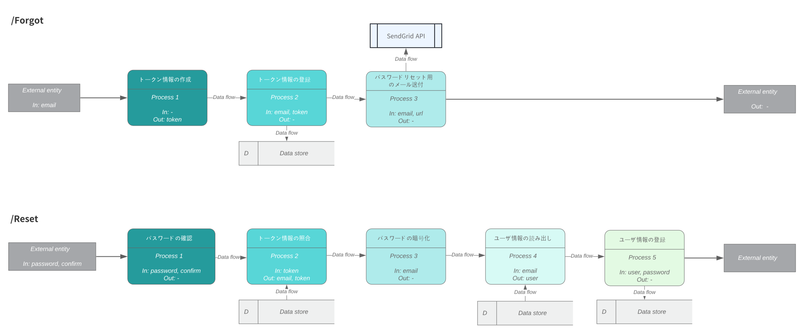
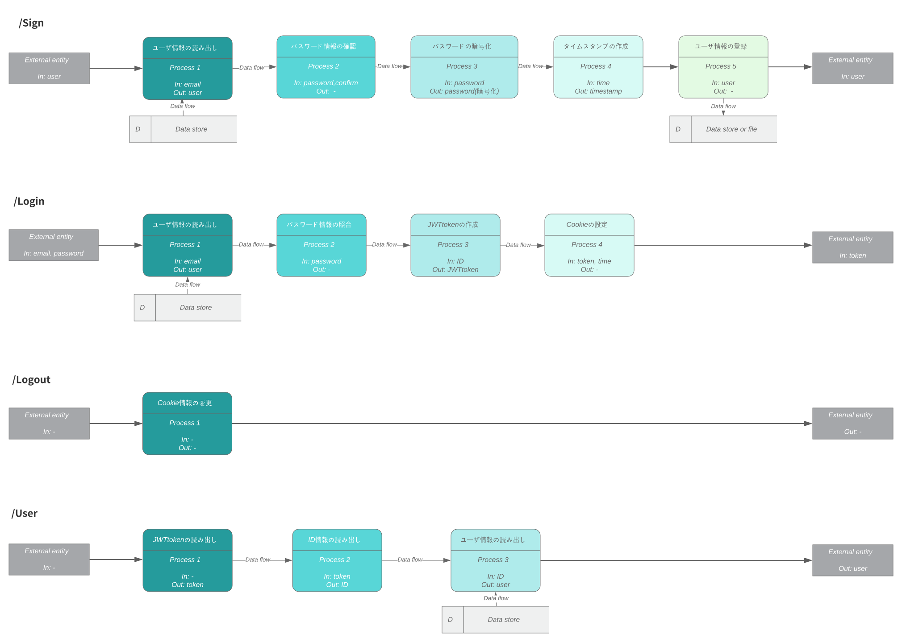
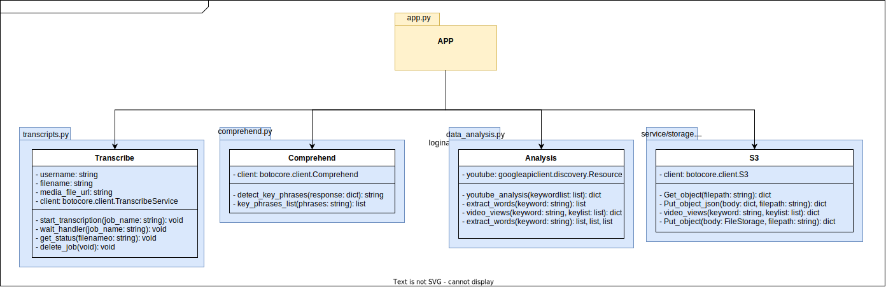
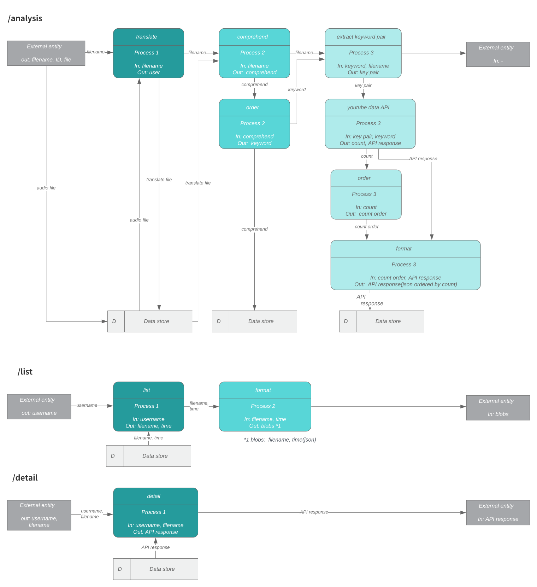

# AWS環境を用いた技術ポートフォリオ
本ページはaws環境のポートフォリオになります。
本ポートフォリオにて使用しているAWS Serviceは以下になります。
* Server: Fargate(, ECS)
* Registry: ECR
* Server less: Lambda
* Network: VPC, Load balancer
* Gateway: API Gateway 
* DB: DynamoDB(NoSQL)
* Storage: S3
* Authority: IAM
* Moniter: Cloud Watch
* Infrastructure: CloudFormation
* ML service: Transcribe, Comprehend


また、AWSに関する以下資格も取得しております。
* AWS Certified Solutions Architect - Associate

以下はAWS公式サイト抜粋[(リンク)](https://aws.amazon.com/jp/certification/certified-solutions-architect-associate/)

SAA(AWS Certified Solutions Architect - Associate) は、幅広い AWS のサービスにわたる AWS テクノロジーに関する知識とスキルを示します。この認定の焦点は、コストとパフォーマンスが最適化されたソリューションの設計にあり、AWS Well-Architected フレームワークに関する深い理解を示します。この認定は、認定された専門家のキャリアプロファイルと収益を向上させ、利害関係者やお客様とのやり取りにおける信頼性と自信を高めます。

## Service abstract
### Service Name 
* AUD analysis

動画・音声ファイルのｷーﾜーﾄﾞを算出するサービスです。qiita記事に本アプリケーションの詳細を記載しておりますので、必要に応じて参考ください。
(コスト面からGCP環境にてdeployしていますが機能は変わりないです。)
[https://qiita.com/confort/items/bcf7fa50a12838eee0a3](https://qiita.com/confort/items/bcf7fa50a12838eee0a3)

# Architecture

<!-- Adopts microservice architecture. The backend is managed individually by deploying it in the form of API for each service.

User registration and login information are controlled between FrontEnd-BackEnd: loginAPI, video, audio information are analyzed and keyword information is estimated between FrontEnd-BackEnd: keywordAPI. -->

マイクロサービスアーキテクチャを採用しています。 バックエンドは、サービスごとにAPIの形式でデプロイすることにより、個別に管理されます。(ポートフォリオの都合から、今回は同一リポジトリ内のディレクトリ単位で管理)

ユーザー登録およびログイン情報管理はFrontEnd-BackEnd(loginAPI)間で制御されます。ビデオ、オーディオ情報が分析され、キーワード情報がFrontEnd-BackEnd(keywordAPI)間で算出される仕組みです。


## Architecture concept

* ### AWS環境を用いたアーキテクチャ設計

AWS環境を活用したアーキテクチャを作成。その上で、マイクロサービスの設計を活かすため、各機能単位で独立させた上でスケーリングができるようにDeploy環境を決定していく。


Frontendではpublicアクセス可能なS3(Sinple Storage Service)を採用。CloudFrontによるサーバ負荷低減も検討中。

Gateway-Backend間でload balancerを使用。また、サーバ選定ではインスタンスを増減できるECS(Elastic Container Service)をBackEndに使用する事で、アクセス負荷に耐えられるようにしている。


作成したAPIの詳細については、以下のAPI仕様を参照してください。

<!-- ** There are some parts that are in the process of being created, and there are parts that do not reflect the above architecture.

Please refer to the following API specifications for the details of the created API. -->

* [loginAPI](https://github.com/hender14/AUD_analysis/tree/main/loginapi)

* [keywordAPI](https://github.com/hender14/AUD_analysis/tree/main/keywordapi)

## Security

Frontendでは、AWS S3へのアクセスを公開している事から、S3側のバケットルール側を制限する事にてアクセスを制限する。

Backend側では、Private network化によって外部からアクセスできないようにしている。また、private networkへの経路に関してもAPI Gateway, IAMによるアクセス制限、アプリケーションでのCORSの設定にて対応。こちらの設定にてAPI Gateway経由外でのBackEnd側のアクセスは拒否でき、Gatewayへのアクセス制限も実施する事で想定外のアクセスに対するリスクを抑制する。

### Function
* パスワードの暗号化
* フロントエンドとバックエンド間のCORSによるアクセス制御
* JWTトークンを使用したログイン認証
* Backend機能のpraivate network環境化
* ゲートウェイとバックエンド間でアクセスするためのAWS IAMによるアプリケーション権限管理
* AWS API Gatewayを使用したバックエンドへのアクセス制御
* AWS S3バケットのアクセスルール管理

<!-- * Password encryption
* Access control by CORS between FrontEnd and BackEnd 
* Login authentication with JWT token
* Application permission management with GCP IAM to access between Gateway and BackEnd
* Access control to BackEnd with GCP API GATEWAY
* Manage Google Cloud Storage bucket Access rules -->

## CI/CD

Devops面では、アジャイル開発による機能のupdateを実施するため自動化でのCI/CD環境を作成。(Github Action + CloudFormation)

### Test

Test/Build/AWS環境へのUploadは、Github Actionによって自動的に行われます。

<!-- test/build/uploading registry are automatically done by github action. -->

#### 設定ファイル
* [Frontend](https://github.com/hender14/AUD_analysis/blob/devlop/.github/workflows/dep_frontend.yml)
* [loginAPI](https://github.com/hender14/AUD_analysis/blob/devlop/.github/workflows/dep_login.yml)
* [keywordAPI](https://github.com/hender14/AUD_analysis/blob/devlop/.github/workflows/dep_keyword.yml)

** テストパタンは作成途中のため、現状十分なカバレッジを持っていません。
### Deploy

Deployは以下方法にで実行されます。
<!-- deploy is done by terraform. -->

* Frontend

GIthub Actionsにて自動実行。Githubリポジトリのdevlopブランチにマージする事で以下コマンドが実行されます。

```bash
# S3へのアップロード
aws s3 cp --recursive --region ${{ secrets.AWS_DEFAULT_REGION }}  dist/ s3://$S3_UPLOAD_BUCKET/ --quiet
```

Backend側のdeployはCloudFormationの機能を使用して実行。deploy先のnetwork, gateway機能も含めてまとめて起動する。詳細は[設定ファイル](https://github.com/hender14/AUD_analysis/blob/devlop/Infrastructure)を参考ください。

* loginapi
```bash
# テンプレート内容のチェック
aws cloudformation validate-template –template-url Infrastructure/loginapi/network.yaml
# スタックの作成
aws cloudformation create-stack –stack-name loginapi –template-body Infrastructure/loginapi/network.yam
# スタックの削除
aws cloudformation delete-stack –stack-name loginapi
```

* keywordapi
```bash
# テンプレート内容のチェック
aws cloudformation validate-template –template-url Infrastructure/keywordapi/network.yaml
# スタックの作成
aws cloudformation create-stack –stack-name loginapi –template-body Infrastructure/keywordapi/network.yam
# スタックの削除
aws cloudformation delete-stack –stack-name keywordapi
```
# Apprication detail


## BackEnd


## loginAPI

* ### Architecture concept

login機能は処理速度が要求される事から、golang言語を採用。

保守性の観点から、Clean Archtectureを採用。「外側のレイヤは内側のレイヤだけに依存する」というルールを守ることによって，アプリケーションから技術を分離して、DB等の外部interfaceの変更を容易にできる。またモックによるテスト実装も容易になるメリットもある。

### skill
* gin framework (golang)

### deploy environment
* AWS Elastic Container Service (Task: Fargate)

### Component structure


### Data FLow figure



*user: email, name, password, time, ID items


作成したAPIの詳細については、以下のAPI仕様を参照してください。

<!-- Please refer to the following API specifications for the details of the created API. -->

* [loginAPI](https://github.com/hender14/AUD_analysis/tree/main/loginapi)

## keywordAPI

### Architecture concept

keyword算出機能は、多種のAPIの利用およびデータ加工、演算処理が要求される事から、上記ライブラリの豊富なPython言語を採用。

保守性の観点からオブジェクト指向を採用。クラス単位で処理をまとめ、コードの再利用を促進し、システムの開発や保守にかかるトータル時間を短縮を可能にする。また、各クラス間の依存関係を無くしてソフト構図をシンプルにした。

### skill
* flask framework (Python)

### deploy environment
* AWS Elastic Container Service (Task: Fargate)

### Class structure


### Data Flow figure


作成したAPIの詳細については、以下のAPI仕様を参照してください。

<!-- Please refer to the following API specifications for the details of the created API. -->

* [keywordAPI](https://github.com/hender14/AUD_analysis/tree/main/keywordapi)

## FrontEnd

* ### Architecture concept

レスポンスを向上させるため、SPA(Single Page Application)を採用。各機能をコンポーネントに集約させ、アクセスの際に必要最低減の箇所を更新させる事でレスポンスを向上させる。

### skill
* vue.js framework (typescript)

### deploy environment
* AWS Sinple Storage Service

### Data Flow structure
under creating

### Directry figure

