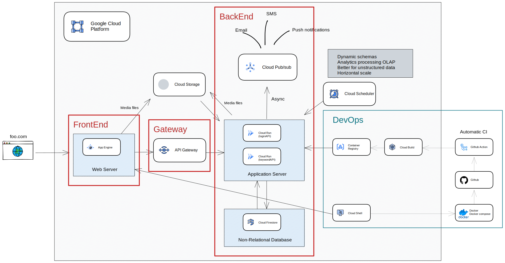
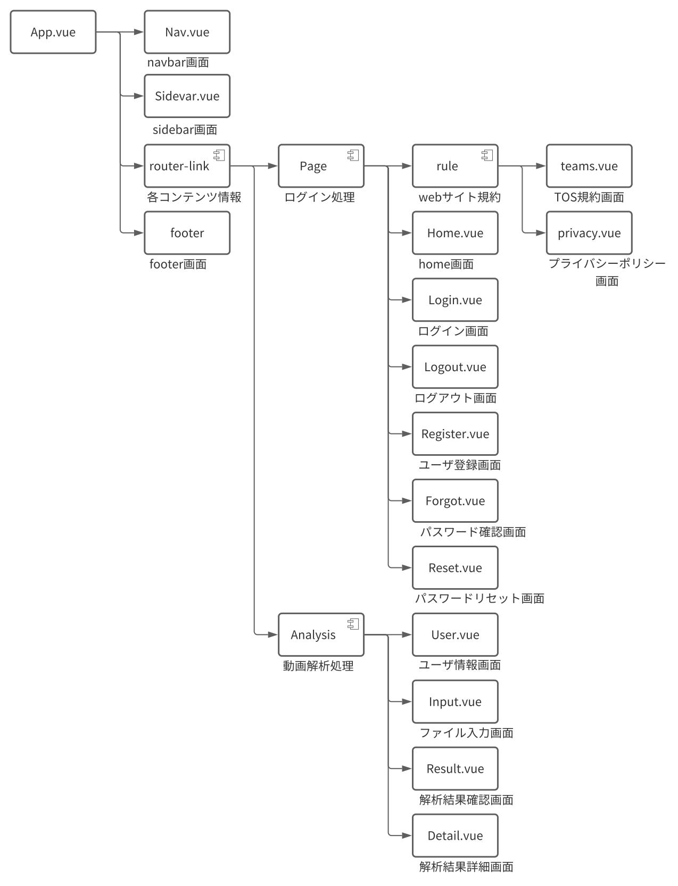
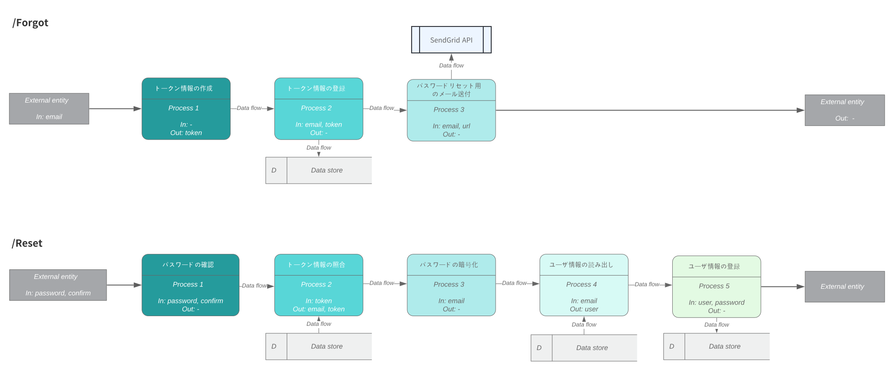
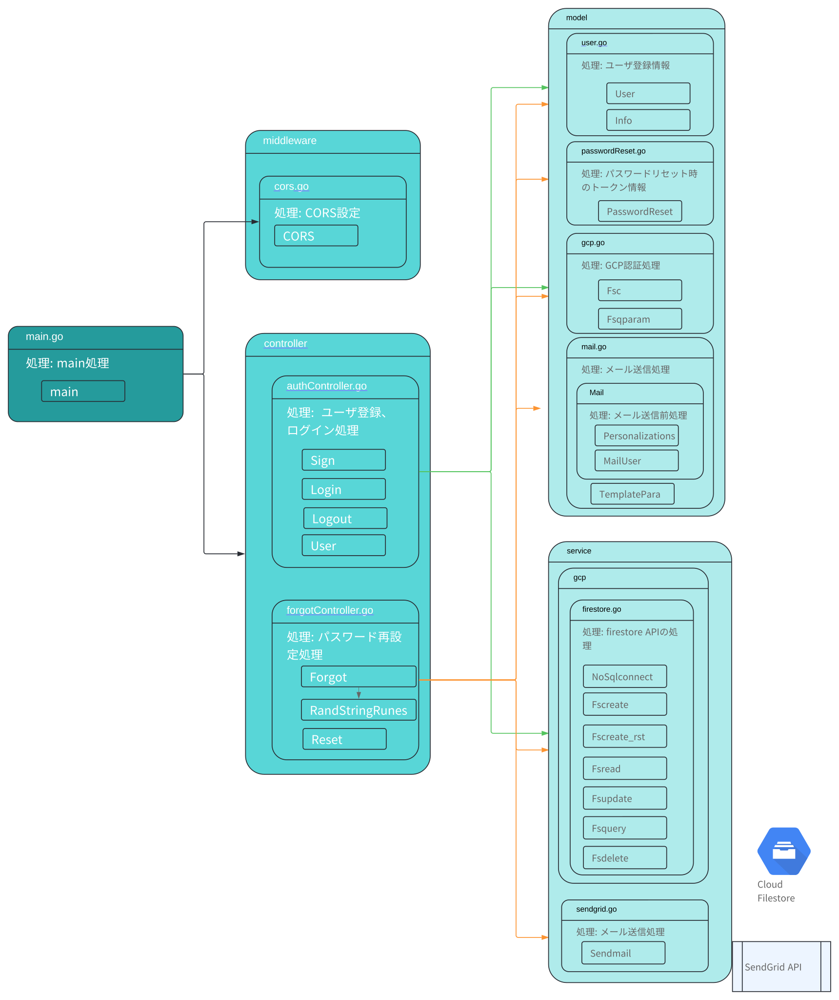
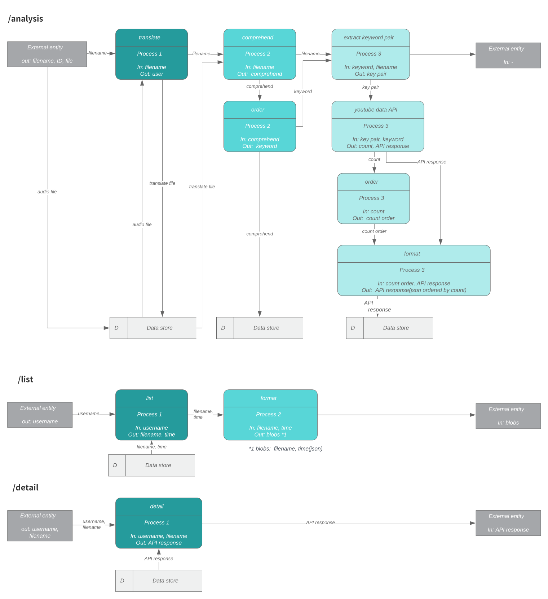
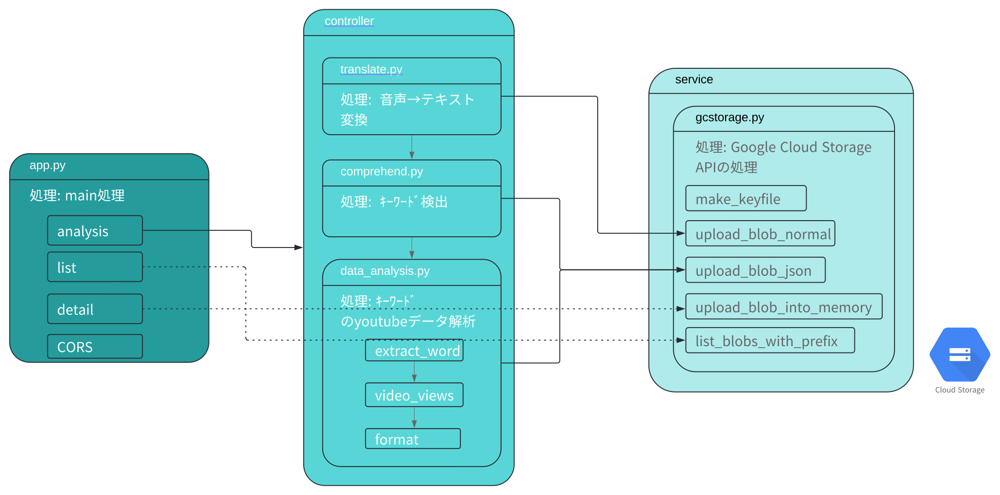

# AUD analysis


## Service abstract
動画・音声ファイルのｷーﾜーﾄﾞを算出するサービスです。必要な操作は非常に容易で、動画をアップロードするのみ。動画をアップロードして頂ければ、本アプリケーションが内容を解析して動画に関するアドバイスを提供します。


## URL

[https://gold-cycling-307817.an.r.appspot.com](https://gold-cycling-307817.an.r.appspot.com)

## Background

動画配信サービスは、スマートフォンやインタｰネットインターネットの普及によって年々利用者が増えています。その中でもYoutubeは基本使用料が無料であることもあり、突出して人気があります。​

ただし、動画配信者目線で見た場合動画が飽和しており再生数を伸ばすことが困難となってきています。​

その中で、動画の再生数を増加させるためにはユーザの検索に引っかかる必要があり、そのためにも検索上位を狙いたいｷーﾜーﾄﾞを決定する事が重要となっていますが、このｷーﾜーﾄﾞを算出する手法が確立されていない事が現状になります。そのため、ｷｰﾜｰﾄﾞをデータ分析によって算出する​事を目的として、本サービスを作成しました。

上記を実施することで、再生数を増加させる事も勿論ですが、データ分析にて自動化する事でクリエイターの負担を軽減する事にも繋がります。​

# Architecture

<!-- Adopts microservice architecture. The backend is managed individually by deploying it in the form of API for each service.

User registration and login information are controlled between FrontEnd-BackEnd: loginAPI, video, audio information are analyzed and keyword information is estimated between FrontEnd-BackEnd: keywordAPI. -->

マイクロサービスアーキテクチャを採用しています。 バックエンドは、サービスごとにAPIの形式でデプロイすることにより、個別に管理されます。(ポートフォリオの都合から、今回は同一リポジトリ内のディレクトリ単位で管理)

ユーザー登録およびログイン情報管理はFrontEnd-BackEnd(loginAPI)間で制御されます。ビデオ、オーディオ情報が分析され、キーワード情報がFrontEnd-BackEnd(keywordAPI)間で算出される仕組みです。


## Architecture concept

* ### コストミニマムの達成

コストミニマム(≒0円/月)を達成する事を目標にアーキテクチャを作成。そのためGCPの無料枠を前提としてDeploy環境を決定。
サーバ選定ではアクセス負荷やDDos対策の面からload balancerが選択肢に上がるが、GCPでは1500円/月程度費用としてかかる事から断念。アクセスの急負荷の対応には難があるものの、インスタンスを増減できるApp EngineをFrontEndとして、BackEndに関してもCloud Runを使用してスケーリングすると共に、アクセスが無いタイミングでは、インスタンス数を0にすることで使用時間を低減してコストを抑制する。アクセス負荷に対応する必要が出てこれば、VM環境を用いてload balancerを自作する等で対応する予定。

また、FrontEndにて入力される音声ファイルについて、BackEndへのデータ転送コストを抑制するため、バケット経由にてBackEnd側へファイル転送を行う。



**作成途中のため、現状のリポジトリが上記アーキテクチャを一部反映できていない部分があります。

作成したAPIの詳細については、以下のAPI仕様を参照してください。

<!-- ** There are some parts that are in the process of being created, and there are parts that do not reflect the above architecture.

Please refer to the following API specifications for the details of the created API. -->

* [loginAPI](https://github.com/hender14/AUD_analysis/tree/main/loginapi)

* [keywordAPI](https://github.com/hender14/AUD_analysis/tree/main/keywordapi)

## Security

FrontEndでは、Cloud Storageへのアップロードキーが開示されている事から、storage側のバケットルール側を制限する事にてアクセスを制限する。

BackEnd側では、Privateネットワーク化(VPCコネクタの使用)を検討したがVPC用にサーバコストが必要になるため断念。低コスト実現のため、API Gateway, IAMによるアクセス制限、アプリケーションでのCORSの設定にて対応。こちらの設定にてAPI Gateway経由外でのBackEnd側のアクセスは拒否でき、Gatewayへのアクセス制限も実施する事で想定外のアクセスに対するリスクを抑制する。

### Function
* パスワードの暗号化
* フロントエンドとバックエンド間のCORSによるアクセス制御
* JWTトークンを使用したログイン認証
* ゲートウェイとバックエンド間でアクセスするためのGCP IAMによるアプリケーション権限管理
* GCP API Gatewayを使用したバックエンドへのアクセス制御
* Google Cloud Storageバケットのアクセスルールを管理する

<!-- * Password encryption
* Access control by CORS between FrontEnd and BackEnd 
* Login authentication with JWT token
* Application permission management with GCP IAM to access between Gateway and BackEnd
* Access control to BackEnd with GCP API GATEWAY
* Manage Google Cloud Storage bucket Access rules -->

## CI/CD

Devops面では、アジャイル開発による機能のupdateを実施するため自動化でのCI/CD環境を作成。(Github Action + terraform)
ただし、deploy時のコードエディタに関してはGCPのインフラとの相性(debug環境他)からCloud Shellを採用。
### Test

Test/Build/GCPへのUploadは、Github Actionによって自動的に行われます。

<!-- test/build/uploading registry are automatically done by github action. -->

#### 設定ファイル
* [loginAPI](https://github.com/hender14/AUD_analysis/blob/devlop/.github/workflows/dep_login.yml)
* [keywordAPI](https://github.com/hender14/AUD_analysis/blob/devlop/.github/workflows/dep_keyword.yml)

** テストパタンは作成途中のため、現状十分なカバレッジを持っていません。
### Deploy

Deployはterraformを使用して行われます。Deploy設定は必要最低限の機能で構成しています。
<!-- deploy is done by terraform. -->

* Frontend
```bash
cd Frontend/ui/
gcloud config set project ${PROJECT}
gcloud app deploy
```

* loginapi
```bash
cd loginapi/terraform/
terraform init
terraform workspace new tf-login
terraform plan
terraform apply -auto-approve
terraform destroy
```

* keywordapi
```bash
cd keywordapi/terraform/
terraform init
terraform workspace new tf-keyword
terraform plan
terraform apply -auto-approve
terraform destroy
```
# Apprication detail


## FrontEnd

* ### Architecture concept

レスポンスを向上させるため、SPA(Single Page Application)を採用。各機能をコンポーネントに集約させ、アクセスの際に必要最低減の箇所を更新させる事でレスポンスを向上させる。

### skill
* vue.js framework (typescript)

### deploy environment
* Google App Engine (Google PaaS service)

### DFD structure
under creating

### Directry figure



## BackEnd


## loginAPI

* ### Architecture concept

login機能は処理速度が要求される事から、go言語を採用。

また、保守性の観点から、ルーティング(API)層、コントローラ層(主なロジック)、他APIサービス、ライブラリへのアクセス層と層別する事で、Deploy環境の変更等の変化にも対応できるように構成している。従来のMVC設計を参考にmodel層も作成する事で保守性を上げている。

### skill
* gin framework (golang)

### deploy environment
* Google Cloud Run (Google container managed service)

### DFD figure



*user: email, name, password, time, ID items

### Component structure



作成したAPIの詳細については、以下のAPI仕様を参照してください。

<!-- Please refer to the following API specifications for the details of the created API. -->

* [loginAPI](https://github.com/hender14/AUD_analysis/tree/main/loginapi)

## keywordAPI

### Architecture concept

keyword算出機能は、多種のAPIの利用およびデータ加工、演算処理が要求される事から、Python言語を採用。

また、保守性の観点から、ルーティング(API)層、コントローラ層(主なロジック)、他APIサービス、ライブラリへのアクセス層と層別する事で、Deploy環境の変更等の変化にも対応できるように構成している。今後、オブジェクト指向のコードへ修正予定。

### skill
* flask framework (Python)

### deploy environment
* Google Cloud Run (Google container managed service)

### DFD figure


### Component structure


作成したAPIの詳細については、以下のAPI仕様を参照してください。

<!-- Please refer to the following API specifications for the details of the created API. -->

* [keywordAPI](https://github.com/hender14/AUD_analysis/tree/main/keywordapi)